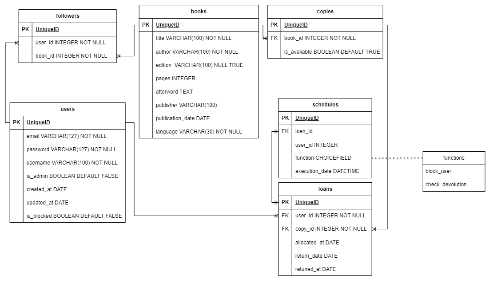

# BiblioteKA

## Tabela de Conteúdos

- [Visão Geral](#1-visão-geral)
- [Diagrama ER](#2-diagrama-er)
- [Iniciar a Api localmente](#3-início-rápido)
    - [Criando ambiente virtual](#31-criando-ambiente-virtual)
    - [Ative seu venv](#32-ative-seu-venv)
    - [Variáveis de Ambiente](#33-variáveis-de-ambiente)
    - [Instalando dependências](#34-instalando-dependências)
    - [Migrations](#35-migrations)
    - [Inicializar o servidor](#36-inicializar-o-servidor)
- [Documentação das rotas](#4-documentação-das-rotas)

---

## 1. Visão Geral

Um pouco das tecnologias usadas.

- [Python](https://www.python.org/)
- [Django](https://www.djangoproject.com/)
- [Django REST framework](https://www.django-rest-framework.org/)
- [PostgreSQL](https://www.postgresql.org/)
- [Advanced Python Scheduler](https://apscheduler.readthedocs.io/en/3.x/)

URL base da aplicação:
https://biblioteka-group18.onrender.com/

---

## 2. Diagrama ER
[ Voltar para o topo ](#tabela-de-conteúdos)


Diagrama ER da API definindo as relações entre as tabelas do banco de dados.



---

## 3. Iniciar a Api localmente
[ Voltar para o topo ](#tabela-de-conteúdos)


### 3.1. Criando ambiente virtual

Após clonar o projeto em sua máquina, crie seu ambiente virtual:

```bash
python -m venv venv
```

### 3.2. Ative seu venv

```bash
# Linux:
source venv/bin/activate

# Windows (Powershell):
.\venv\Scripts\activate

# Windows (Git Bash):
source venv/Scripts/activate
```

### 3.3. Variáveis de Ambiente

Em seguida, crie um arquivo **.env**, copiando o formato do arquivo **.env.example**:
```
cp .env.example .env
```
Seguindo os exemplos presentes no .env.example:</br>
Configure suas variáveis de ambiente com suas credenciais do Postgres e uma nova database da sua escolha.</br>
Configure quantos dias durará um empréstimo e quantos dias será o prazo de desbloqueio.</br>
Configure também o intervalo em horas de execução do script, os dias e horários de funcionamento da biblioteca.


### 3.4. Instalando dependências 

Instale as dependências com o comando:

```bash
pip install -r requirements.txt
```

### 3.5. Migrations 

Execute as migrations com o comando:

```bash
python manage.py migrate
```

### 3.6. Inicializar o servidor 

Por fim, utilize o seguinte comando para rodar o servidor localmente:

```bash
python manage.py runserver
```

## 4. Documentação das rotas
[ Voltar para o topo ](#tabela-de-conteúdos)

Link da documentação: 
https://biblioteka-group18.onrender.com/api/docs/redoc/
---
